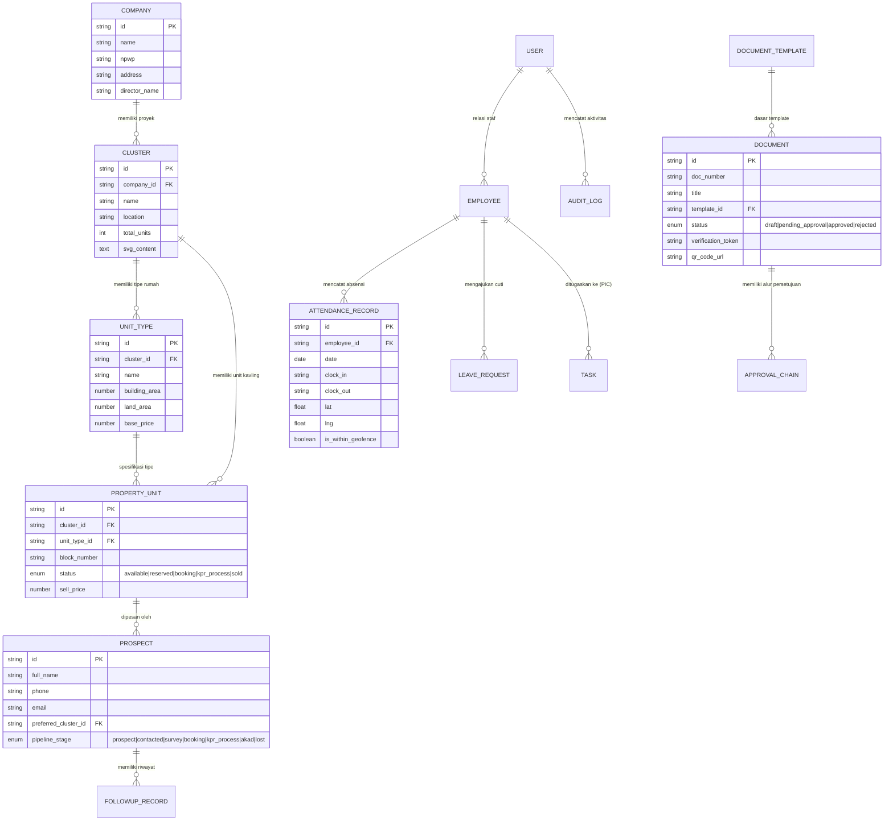
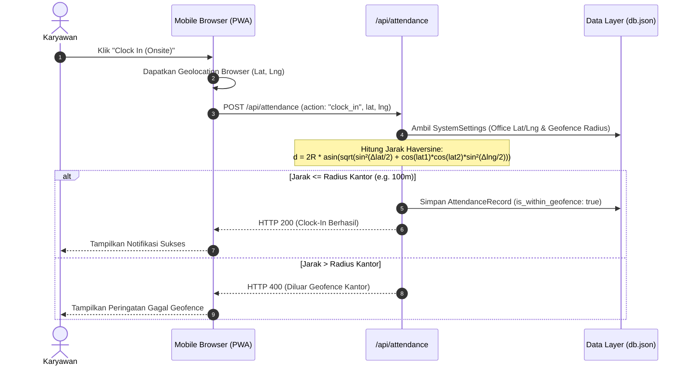
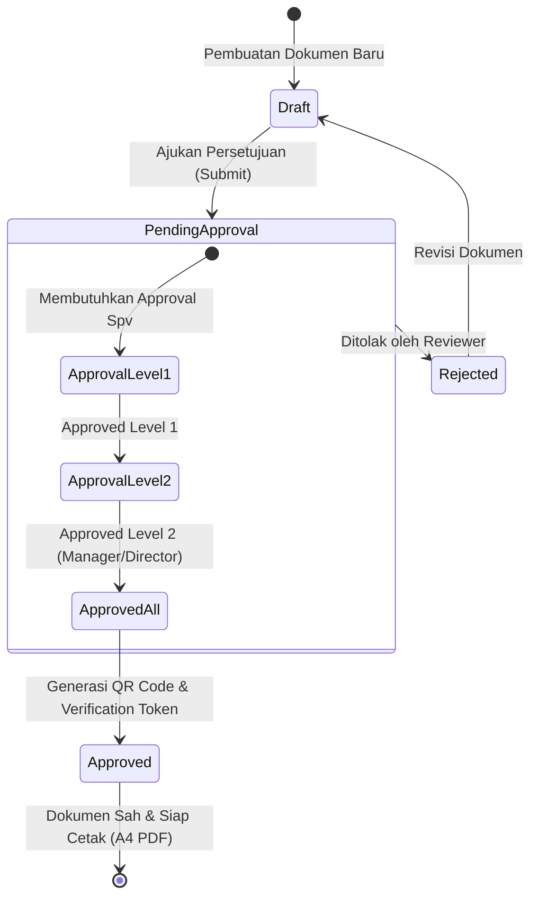

# System Design Document (SDD)
## Domus CRM & Operasional Developer Perumahan

Dokumen ini menyajikan perancangan sistem (*system design*) secara menyeluruh untuk aplikasi **Domus CRM & Operasional**, sebuah platform manajemen internal berbasis **Progressive Web App (PWA)** yang dirancang khusus untuk memenuhi kebutuhan operasional, pemasaran properti, absensi GPS, manajemen dokumen berjenjang, dan tata kelola unit perumahan.

---

## 1. Ringkasan Sistem & Tech Stack

Aplikasi ini menggunakan arsitektur **Full-Stack Monolith (Next.js App Router)** dengan pemisahan yang tegas antara antarmuka pengguna (Frontend Components), Layanan Serverless (Route Handlers), dan Lapisan Akses Data (JSON File Database Abstraction).

### Tech Stack Utama

| Lapisan | Teknologi / Library | Versi | Fungsi / Deskripsi |
| :--- | :--- | :--- | :--- |
| **Framework Utama** | [Next.js](https://nextjs.org/) (App Router) | v16.2.7 | SSR, SSG, Routing, API Route Handlers |
| **UI Library** | [React](https://react.dev/) / React DOM | v19.2.4 | Komponen UI reaktif & Hooks |
| **Styling & Theme** | [Tailwind CSS v4](https://tailwindcss.com/) & [@HeroUI React](https://heroui.com/) | v4.x / v3.1.0 | Desain responsif, Glassmorphism, UI System |
| **Animasi UI** | [Framer Motion](https://www.framer.com/motion/) | v12.40.0 | Micro-animations, drawer, transisi modal |
| **Ikonografi** | [Lucide React](https://lucide.dev/) | v1.17.0 | Pustaka ikon SVG |
| **Pemetaan & GIS** | [Leaflet.js](https://leafletjs.com/) (via CDN) | v1.9.4 | Peta interaktif GPS geofencing & kavling |
| **Database** | File-based JSON Database (`lib/db.ts`) | Custom | Persistence lokal di `data/db.json` dengan synchronous I/O |
| **Integrasi Notifikasi** | Telegram Bot API (`lib/telegram.ts`) | REST API | Notifikasi real-time & webhook event |
| **PWA & Offline** | Web App Manifest & Service Worker | Standard PWA | Mobile standalone mode & offline sync absensi |

---

## 2. Arsitektur Sistem Tingkat Tinggi (High-Level Architecture)

Aplikasi dirancang dengan pola arsitektur berlapis (*layered architecture*) yang memisahkan presenter, bisnis logika, dan persistensi data.

```mermaid
graph TD
    subgraph Client Layer [Client & PWA Environment]
        A[Mobile Browser / PWA Standalone]
        B[Desktop Web Browser]
    end

    subgraph Presentation & State Layer [Next.js App Router - Client Components]
        C[AppShell & Navigation]
        D[AuthContext & Role Switcher]
        E[CrudModalContext & Global State]
        F[Leaflet GIS & Interactive Kavling Map]
    end

    subgraph Application & API Layer [Next.js Serverless Route Handlers]
        G[/api/attendance - Geofence & Sync/]
        H[/api/crm - Pipeline & Followup/]
        I[/api/documents - Generator & Approval/]
        J[/api/tasks - Task Management/]
        K[/api/telegram - Notification Dispatcher/]
        L[/api/search - Global Search Engine/]
        M[/api/settings - Config Management/]
        N[/api/db - Backup/Restore & Operations/]
    end

    subgraph Core Domain Services [Business Logic Modules]
        O[Haversine Geofence Engine]
        P[Approval Hierarchy Engine]
        Q[QR Code Generator & Verification]
        R[A4 CSS Print Engine]
    end

    subgraph Data Access & Persistence [Data Layer]
        S[db.ts - Abstraction Layer]
        T[(data/db.json - JSON Storage)]
    end

    subgraph External Services [External Integrations]
        U[Telegram Bot API]
        V[OpenStreetMap / Leaflet CDN]
    end

    A --> C
    B --> C
    C --> D
    C --> E
    C --> F

    Presentation & State Layer --> Application & API Layer
    Application & API Layer --> Core Domain Services
    Core Domain Services --> S
    Application & API Layer --> S
    S <--> T

    K --> U
    F --> V
```

---

## 3. Struktur Modul & Matriks Routing (Module Breakdown)

Aplikasi terbagi menjadi modul-modul fungsional yang dapat diakses sesuai skema peran pengguna (*Role-Based Access Control*).

```
src/
├── app/
│   ├── absensi/          # Modul Absensi GPS & Pengajuan Cuti
│   ├── api/              # Serverless API Route Handlers
│   ├── backoffice/       # Modul Kelola Pengguna, Perusahaan & Audit Log
│   ├── crm/              # Modul CRM Deals & Sales Pipeline
│   ├── documents/        # Modul Generator Dokumen & Approval Berjenjang
│   ├── monitoring/       # Modul Monitoring Peta Cluster & Siteplan
│   ├── properties/       # Modul Manajemen Unit Properti & Cluster
│   ├── prospects/        # Modul Database Prospek & Log Follow-up
│   ├── tasks/            # Modul Tugas & To-Do Operasional
│   ├── verify/[token]/   # Portal Verifikasi Publik Dokumen (via QR Code)
│   ├── globals.css       # Design System, Glassmorphism, & CSS Engine Cetak A4
│   ├── layout.tsx        # Root HTML & Metadata Layout
│   └── page.tsx          # Dashboard Utama & Executive Metrics
├── components/
│   ├── AppShell.tsx            # Navigation Sidebar, Topbar & Layout Wrapper
│   ├── EditProfileModal.tsx     # Modal Edit Profil Pengguna
│   ├── GlobalSearchModal.tsx   # Modal Quick Search (Shortcut Ctrl+K)
│   ├── KavlingMap.tsx          # Peta Interaktif SVG Blok/Kavling
│   ├── MapPicker.tsx           # Modal Leaflet.js GPS Location Selector
│   ├── MonitoringMap.tsx       # View Peta Monitoring Proyek
│   └── PrintDocumentModal.tsx  # Modal Preview & Engine Cetak Dokumen PDF A4
├── context/
│   ├── AuthContext.tsx         # Context Simulasi Sesi Login & Role Switcher
│   └── CrudModalContext.tsx    # Context Dynamic CRUD Modals (Create/Edit/Delete)
└── lib/
    ├── db.ts                   # Data Access Layer & Seed Data Storage
    ├── telegram.ts             # Integrasi Notifikasi Telegram API
    └── terbilang.ts            # Helper Konversi Angka ke Kalimat Terbilang Rupiah
```

---

## 4. Perancangan Model Data & Skema Entitas (Database ERD)

Seluruh data di-persist dalam berkas `data/db.json` melalui kelas abstraksi `db` di [db.ts](file:///home/nygma/domus-somnia/perumahan-app-2/src/lib/db.ts).

### Diagram Hubungan Entitas (ERD)



### Detail Entitas Kunci

1. **`User` & `Employee`**:
   - `User`: Akun otentikasi (`role`: `'admin' | 'manager' | 'staff'`), daftar `accessible_clusters` untuk pembatasan data per proyek.
   - `Employee`: Data karyawan (`department`, `annual_leave_balance`, `join_date`).
2. **`Company`, `Cluster`, `UnitType`, & `PropertyUnit`**:
   - `Company`: Badan hukum developer perumahan.
   - `Cluster`: Proyek perumahan yang dilengkapi data pemetaan SVG (`svg_content`) untuk visual interaktif kavling.
   - `PropertyUnit`: Unit rumah individual berbasis nomor blok (`block_number`) dengan penanda status pemasaran (*available, reserved, booking, kpr_process, sold*).
3. **`Prospect`, `FollowupRecord`, & `FollowupComment`**:
   - `Prospect`: Pipa konversi penjualan properti.
   - `FollowupRecord`: Catatan interaksi sales (*WhatsApp, Call, Survey*) beserta attachment foto bukti kegiatan.
4. **`Document`, `DocumentTemplate`, & `ApprovalChain`**:
   - Mengelola dokumen resmi (Invoice DP, Kwitansi, SPK, Surat Tugas) dengan alur persetujuan bertingkat (*Approval Chain*) dan penerbitan *Verification Token* unik.
5. **`AttendanceRecord` & `LeaveRequest`**:
   - Rekam jejak absensi harian dengan geolocation GPS dan sistem pemotongan saldo cuti harian.

---

## 5. Sub-sistem Utama & Logika Alur Kerja (Key Subsystems)

### A. Mesin Absensi GPS & Geofencing (Haversine Formula)

Sistem absensi memverifikasi posisi fisik karyawan saat melakukan *Clock-In* atau *Clock-Out* onsite.



### B. Mesin Dokumen, Approval Berjenjang & Verifikasi QR Code

Setiap dokumen resmi yang dibuat mengalami alur persetujuan berjenjang sebelum dianggap sah dan dapat dicetak/diverifikasi.



1. **Tokenisasi & QR Code**: Dokumen bersatus `approved` otomatis mendapatkan `verification_token` 64-karakter dan QR Code unik.
2. **Portal Verifikasi Publik (`/verify/[token]`)**: QR Code yang dipindai kamera HP akan membuka halaman verifikasi tanpa autentikasi, yang menampilkan metadata dokumen asli untuk mencegah pemalsuan dokumen tercetak.
3. **Engine Cetak A4 (Pure CSS)**: Komponen [PrintDocumentModal.tsx](file:///home/nygma/domus-somnia/perumahan-app-2/src/components/PrintDocumentModal.tsx) memanipulasi tampilan via aturan `@media print` pada file `globals.css`:
   - Dimensi container dikunci tepat pada $210\text{mm} \times 297\text{mm}$ (Standard A4).
   - Menyembunyikan sidebar, navbar, dan kontrol UI saat dialog browser print diaktifkan.

### C. Integrasi Telegram Bot Notification

Sistem terhubung dengan Telegram Bot API via [telegram.ts](file:///home/nygma/domus-somnia/perumahan-app-2/src/lib/telegram.ts) untuk mendistribusikan notifikasi mendesak:
- **Event Notifikasi**:
  - Pengajuan dokumen baru yang memerlukan *Approval*.
  - Pembaruan status prospek menjadi *Akad/Booking*.
  - Pengajuan cuti karyawan.
  - Peringatan sistem & audit log kritis.

---

## 6. Spesifikasi API Handlers (REST Endpoints)

Seluruh Endpoint API diimplementasikan pada direktori `src/app/api/` menggunakan Next.js Route Handlers:

| Endpoint | Method | Action Parameter / Purpose | Deskripsi |
| :--- | :--- | :--- | :--- |
| `/api/attendance` | `GET`, `POST` | `clock_in`, `clock_out`, `sync_offline`, `leave_request` | Absensi GPS, rekap absensi, pengajuan cuti & sinkronisasi data offline. |
| `/api/crm` | `GET`, `POST`, `PUT`, `DELETE` | `add_prospect`, `update_stage`, `add_followup` | Pengelolaan pipa penjualan sales, pencatatan log interaksi & prospek. |
| `/api/documents` | `GET`, `POST`, `PUT` | `create_doc`, `approve_doc`, `reject_doc`, `verify` | Pembuatan dokumen, eksekusi alur approval, & verifikasi token QR code. |
| `/api/tasks` | `GET`, `POST`, `PUT`, `DELETE` | `create_task`, `update_status`, `assign_task` | Manajemen daftar tugas operasional internal & penetapan PIC. |
| `/api/settings` | `GET`, `POST` | `update_settings`, `update_company` | Pengaturan koordinat geofence kantor, bot Telegram, & profil developer. |
| `/api/notifications` | `GET`, `POST` | `mark_as_read`, `send_broadcast` | Manajemen pusat notifikasi pengguna di header. |
| `/api/search` | `GET` | `query` | Quick search global untuk prospek, unit, tugas, & dokumen (Ctrl+K). |
| `/api/telegram` | `POST` | `webhook`, `test_connection` | Webhook receiver & pengujian koneksi Telegram Bot. |
| `/api/db` | `GET`, `POST` | `seed`, `backup`, `reset` | Operasi pemeliharaan database JSON & seeding data simulasi. |

---

## 7. Desain Antarmuka & Sistem Estetika (UI/UX Principles)

Aplikasi dirancang dengan standar estetika tinggi sesuai panduan modern web application:

1. **Skema Warna Premium**:
   - **Neutral Base**: Slate Dark (`#0f172a` / `#1e293b`) & Soft Off-White (`#f8fafc`).
   - **Primary Brand**: Indigo / Royal Blue (`#2563eb` / `#4f46e5`).
   - **Accent Status**: Emerald Green (Available/Approved), Amber (Process/Pending), Crimson Red (Sold/Rejected).
2. **Glassmorphism & Card Elevation**:
   - Menggunakan kelas `.glass-panel` (`backdrop-filter: blur(12px)` + semi-transparent border) untuk modal dan floating card.
   - Micro-interaction menggunakan Framer Motion pada hover card unit kavling (`.premium-card`).
3. **Tipografi**:
   - Menggunakan **Google Sans** CDN dengan variasi ketebalan font 300 (Light) hingga 800 (Bold) untuk meningkatkan keterbacaan data numerik & laporan.

---

## 8. Panduan Pengoperasian & Maintenance

### Persyaratan Lingkungan (Prerequisites)
- **Node.js**: v18.x atau lebih baru (Rekomendasi v20 LTS).
- **Package Manager**: `npm` atau `pnpm`.

### Jalankan dalam Mode Pengembang (Development)
```bash
# Install dependensi
npm install

# Jalankan dev server Next.js
npm run dev
```
Aplikasi akan dapat diakses di `http://localhost:3000`.

### Database Persistence & Backup
- Seluruh data tersimpan secara otomatis di `data/db.json`.
- Untuk melakukan reset atau seeding ulang data simulasi, panggil endpoint `/api/db?action=seed` atau hapus file `data/db.json` agar sistem membuat ulang file seed default saat server berjalan.
